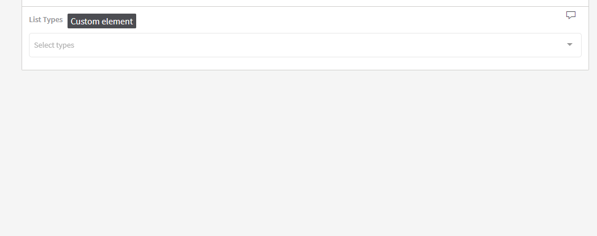
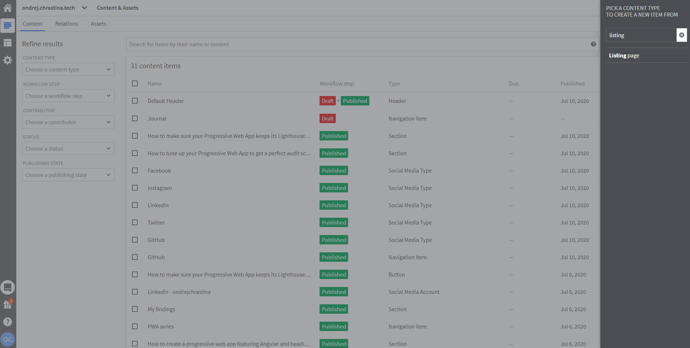

# Kentico Kontent type selector custom element

This [custom element](https://docs.kontent.ai/tutorials/develop-apps/integrate/integrating-your-own-content-editing-features) for [Kentico Kontent](https://kontent.ai) gives editors a way to select [content types](https://docs.kontent.ai/tutorials/manage-kontent/content-modeling/create-and-delete-content-types) from current project.



## Features

- Display optional debug panel for diagnostics

## Quick testing

If you're interested in trying this out without deploying it yourself, you can use [kontent-custom-element-type-selector.netlify.app](https://kontent-custom-element-type-selector.netlify.app) This is the deployed version of the master branch in this repo. **This should only be used for quick testing as it is subject to change**

## Deploying

Netlify has made this easy. If you click the deploy button below, it will guide you through the process of deploying it to Netlify and leave you with a copy of the repository in your account as well.

[](https://app.netlify.com/start/deploy?repository=https://github.com/Simply007/kontent-custom-element-type-selector)

## Configuring the Custom Element

You will need to add the custom element to a content type filling in the hosted code URL and the JSON parameters (see below for details).

The JSON parameters required as as follows:

| Name     | Type   | Description |
| -------- | ------ | ----------- |
| debug    | boolean | (Optional) If present and set to true the debug panel will activate when editing a content item. |

Sample parameters JSON:

```json
{
  "debug": true
}
```

:warning: If the content type is changed, this custom element does not reflect this update in stored value. It could be extended that for every first load it updates all selected values, because the `id` stays the same.

## Sample Value

```json
[
  {
    "id": "94803853-7af8-4b63-a218-5f440c0d692c",
    "name": "Journal",
    "codename": "journal",
    "last_modified": "2020-07-17T08:39:50.4370746Z"
  }
]
```

## Developing

### Initial project setup

```console
npm install
```

### Compiles and hot-reloads for development

```console
npm run serve
```

### Compiles and minifies for production

```console
npm run build
```

### Lints and fixes files

```console
npm run lint
```

## Example scenarios

Allow users to select what types you want in your listing on the website.



### Customize Vue CLI configuration

See [Vue CLI Configuration Reference](https://cli.vuejs.org/config/).
